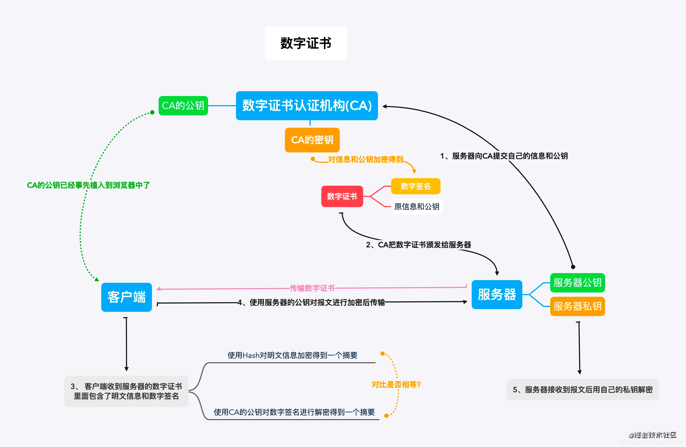

# 计算机基础

### https加密过程是怎样的

```text
HTTPS是在HTTP上建立SSL加密层，并对传输数据进行加密，是HTTP协议的安全版。
HTTPS主要作用是：
（1）对数据进行加密，并建立一个信息安全通道，来保证传输过程中的数据安全；
（2）对网站服务器进行真实身份认证。
传输过程：
1、首先TCP三次握手建立链接，这是数据传输基础，在此之上开始SSL；
2、客户端首先发送Client Hello开始SSL通信，报文中包含客户端支持的SSL版本、随机值Random1、加密算法以及密钥长度等；
3、服务器发送Server Hello，和客户端一样，在报文中包含SSL版本、随机值Random2以及加密组件，此后服务端将证书也发送到客户端；
4、此时客户端需要对服务端发送的证书进行验证，通过操作系统内置的CA证书，将服务器发送的证书的数字签名进行解密，并将证书的公钥进行相同算法的HASH与解密的数字签名解密的内容进行对比，验证证书是否合法有效，是否被劫持更换；
5、客户端验证证书合法，然后生成一个随机值Random3，用公钥对Random3进行加密，生成Pre-Master Key，客户端以Client Key Exchange报文将Pre-Master Key发送到服务端，此后发送Change Cipher Spec报文表示此后数据传输进行加密传输；
6、服务端将Pre-Master Key用自己的私钥解密为Random3，服务端发送Change Cipher Spec报文表示此后数据传输进行加密传输；
7、此时客户端与服务端都拥有三个随机字符串，且Random3是密文传输的，是安全状态的，此时则可以使用这三个字符串进行对称加密传输。由于非对称加密慢，不能每次传输数据都进行非对称加密，所以使用非对称加密将密钥协商好然后使用对称加密进行数据传输；
8、此时便正常进行HTTP数据传输，但是由于SSL加密的作用，此时的HTTP传输便是安全的，此为HTTPS的传输过程，其中2、3、5、6也被称为SSL四次握手
```
数字证书流程



## GET和POST的使用场景和区别

在浏览器端

请求载体：GET位于URL上，POST位于Body上

请求长度： GET有限制，POST无限制

在服务端

无差异

## Cookie和Session的使用场景和区别

存储对象：Cookie是字符串，Session是无限制

存储位置： Cookie是客户端，Session是服务端

Cookie通常和Session搭配一起使用，用于身份认证，鉴权等

## WebSocket 中的心跳是为了解决什么问题？

    1. 为了定时发送消息，使连接不会因为超时自动短线
    2. 为了检测后端是否在线

## XSS  

跨站脚本攻击，通过恶意注入代码，当用户浏览Web的时候被执行来达到恶意攻击的目的

通常分为三种

    1 存储型（server）
    2 反射型 （server）
    3 DOM型（客户端）

防御手段

    1 对输入输出编码，转义
    2 使用CSP等请求白名单配置
    3 输入的时候做一层验证
    4 开启浏览器XSS校验，如Cookie设置SameSite，httponly等
    5 验证码

## CSRF

跨域请求伪造，恶意冒充用户行为，对服务端发起攻击

防御手段
    
    1 验证码
    2 POST
    3 请求来源限制
    4 token
    

## Web攻击的方式
    1 XSS
    2 CSRF 
    3 SQL注入

## 跨域

同源策略的限制，浏览器基于安全考虑的一种约定，限制的是域名，端口，协议三者

限制的内容有Web存储内容Cookie等，DOM，ajax请求

有三个标签允许跨域请求img，script，link

解决方案

1 CORS
```text
满足以下三个条件
1 服务端设置Access-Allow-Control-Credentials:true
2 前端设置withCredentials:true
3 Access-Allow-Control-Origin设置指定的域名
```
2 Nginx代理

3 Node代理

4 JSONP


## HTTP1.1和HTTP2

HTTP1队列阻塞，巨大的头部，明文传输，不支持服务端推送

HTTP2多路复用，头部压缩，必须绑定HTTPS，支持服务端推送
